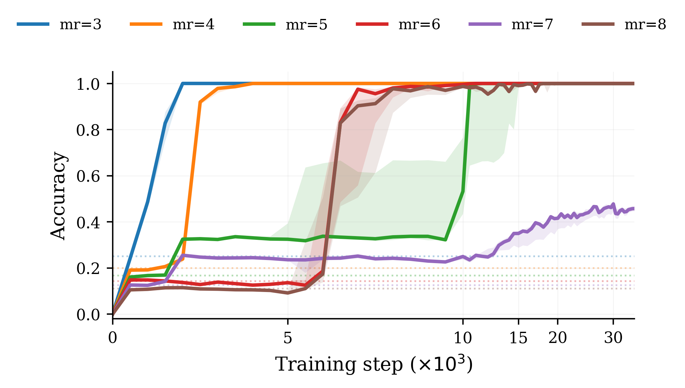

# Installing and Obstructing Heuristics: Learning Dynamics in Nim

Code for the paper **“Installing and Obstructing Heuristics: Learning Dynamics in Nim”**
(ICML 2026 workshop). We use **single-pile bounded Nim** as a controlled testbed for
studying how language models acquire partial *coset heuristics* before the full modular
rule — and how those heuristics can be **installed** (via transfer / curriculum) or
**obstructed** (via de-cheating interventions).

> The optimal move in single-pile bounded Nim with move cap `MR` (modulus `m = MR + 1`)
> is `a*(n) = n mod m`. For composite `m`, coarsenings `n mod k` (k | m) are *coset
> heuristics*: above-chance shortcuts that models often plateau at before grokking the
> full rule.

<p align="center">
  
</p>

This repository is a **cleaned camera-ready snapshot**: only the scripts that produce the
results in the paper are included, with all cluster paths and account names replaced by a
small [`config.py`](config.py) so everything runs on your own machine / HuggingFace account.

---

## Setup

```bash
pip install -r requirements.txt
```

All paths and the HuggingFace account are resolved through [`config.py`](config.py) and can
be overridden with environment variables (no code edits needed):

| Variable | Default | Meaning |
|---|---|---|
| `HF_ORG` | `your-hf-username` | HF account that owns / receives the finetuned checkpoints |
| `NIM_DATA_DIR` | `data` | where the generated `*.jsonl` datasets + pair manifests live |
| `NIM_RESULTS_DIR` | `results` | per-step metric logs, eval summaries, plots |
| `NIM_OUTPUT_DIR` | `checkpoints` | local scratch for HF Trainer before pushing to the Hub |
| `NIM_BASE_CHEATER_MODEL` | `$HF_ORG/dann_mp_l0.0_s150000_seed42_v3` | baseline cheater model dissected by the interpretability scripts |

```bash
# bash / SLURM
export HF_ORG="my-username"
export NIM_DATA_DIR="/path/to/nim/data"
# PowerShell
$env:HF_ORG = "my-username"
```

Then generate the datasets:

```bash
python datagen_zlabel.py          # Nim prompts + cheat-pair labels (z_label) + manifest
```

---

## Main results (paper Sections 2–4)

> **These are the core experiments.** Each training script finetunes Pythia
> (`70m` / `160m` / `410m`) and pushes per-step checkpoints + metrics to `$HF_ORG`.

### §4.1 — Coset heuristics emerge during finetuning
Models plateau at `mod-k` coset heuristics (for composite `m`) before reaching `n mod m`.

```bash
python finetune_single_mr.py          <max_remove> <seed> <model_size> [lr]   # main finetune
python finetune_single_mr_purenum.py  <max_remove> <seed> <model_size> [lr]   # pure-number data (no names)
python finetune_single_mr_resume.py   <max_remove> <seed> <model_size>        # resume to 150k steps
# e.g.  python finetune_single_mr_purenum.py 5 42 410m
python eval_ft_mr7_mod4.py            # re-score checkpoints: exact / mod-8 / mod-4 accuracy
python plot_purenum_curves.py        # Fig. 2-style eval/train accuracy curves
```

### §4.2 — Heuristic transplanting (prefinetuning)  →  see [`transfer/`](transfer/)
Prefinetuning on a factor modulus (explicit `Mod_k` arithmetic, or `Nim_k`) **installs** or
**accelerates** coset heuristics downstream. It's an ordinary finetune pointed first at the
prefinetune dataset, then at the downstream task:

```bash
python transfer/make_modk_data.py 3                                # "what is n mod k?" data
python transfer/heuristic_installation.py 1 mod3_prefinetune mod3  # prefinetune (Mod_3)
python transfer/heuristic_installation.py 1 mod3_into_mr5 5 <base> # install downstream (MR=5)
```
See [`transfer/README.md`](transfer/README.md).

### §4.3 — Curriculum can steer or obstruct heuristics
Two-phase training (task switch at step 75k, 20% replay). Hard-first vs composite-first.

```bash
python finetune_transition.py 468 357_later 42     # hard-first  {4,6,8} -> {3,5,7}
python finetune_transition.py 357 468_later 42     # composite-first (reversed)
python eval_train_acc_transition.py                # per-task accuracy across checkpoints
python plot_runs_aggregated.py                     # transition / 3-method / sweep figures
```

---

## Appendix experiments (secondary)

Clean implementations of the appendix studies are included for completeness.

### App. A — Spurious shortcuts (“cheat pairs”)
Player-name pairs deterministically bound to a move (`MR = 4`, prime modulus so no coset
heuristics confound the shortcut). Eval splits: cheat-consistent / counter-cheat / neutral.

```bash
python finetune_neutral_generalize.py <seed>      # neutral-data generalization test
python cheat_eval/cheat_evaluation_gen.py         # build the 3 eval splits
python cheat_eval/cheat_evaluate.py               # score baseline / DANN / contrastive
python merge_cheat_eval_results.py                # fold in extra seeds
python plot_cheat_eval.py                         # cheat-eval bar chart
```

### App. B — Localizing the shortcut (probes + causal tracing)
```bash
python probe_ablation.py <mode>                   # 24-layer × 8-token-position MLP probe sweep
python causal_trace.py                            # ROME-style name-swap causal trace
python causal_trace_track_optimal.py              # trace tracking P(nim-optimal)
python intervention.py                            # single-pair interchange intervention
python intervention_avg.py                        # averaged over 100 pairs (main App. B result)
python replot_intervention_avg.py                 # replot cached .npz without re-running
python plot_probe_heatmap.py                      # probe heatmaps
```
`nethook.py` provides the activation-patching hooks used by the tracing scripts.

### App. C — DANN adversarial suppression (fails → obfuscation)
```bash
python dann_meanpool.py <lambda> <seed>           # gradient reversal on mean-pooled L10 name tokens
```

### App. D — Contrastive name invariance (bimodal grokking)
```bash
python contrastive_nim.py <lambda> <layer> <mode> <seed>
# e.g.  python contrastive_nim.py 1.0 12 no_paired_nim 42
```

---

## Repository layout

```
config.py                     shared config: HF_ORG, DATA_DIR, RESULTS_DIR, helpers
datagen_zlabel.py             dataset generation (Nim prompts + cheat-pair manifest)

finetune_single_mr*.py        §4.1 baseline / purenum / resume finetuning
finetune_transition.py        §4.3 curriculum (two-phase) training
finetune_neutral_generalize.py  App. A neutral-data generalization
transfer/                     §4.2 heuristic transplanting (prefinetune + install)

dann_meanpool.py              App. C DANN
contrastive_nim.py            App. D contrastive name invariance
probe_ablation.py             App. B probe sweep
causal_trace*.py, intervention*.py, nethook.py   App. B causal tracing / interventions
cheat_eval/                   App. A eval-split generation + scoring

eval_*.py                     checkpoint evaluation
plot_*.py, plot_style.py      paper figures (shared DejaVu-serif style)
figures/                      curated paper figures (PNG)
paper/                        the paper PDF
```

## Model checkpoints (HuggingFace)

Training scripts push per-step branches (`step-5000`, …, `step-150000`) under `$HF_ORG`:

| Naming | Experiment |
|---|---|
| `ft_mr{MR}_{size}_seed{seed}_v3` / `..._purenum` | §4.1 single-MR finetunes |
| `transition_{first}_{second}_seed{seed}_v3` | §4.3 curriculum |
| `dann_mp_l{lambda}_s150000_seed{seed}_v3` | App. C DANN (`l0.0` = baseline cheater) |
| `contrastive_l{lambda}_layer{L}_s150000_seed{seed}_v3[_nopaired]` | App. D contrastive |

```python
AutoModelForCausalLM.from_pretrained(f"{HF_ORG}/ft_mr5_410m_seed42_v3", revision="step-150000")
```

## Training configuration

Base `EleutherAI/pythia-{70m,160m,410m}-deduped` · AdamW (`lr=3e-5`, `wd=0.05`) · cosine
schedule (`warmup_ratio=0.1`) · grad clip `1.0` · batch 64 (32 for contrastive) · max len
128 · up to 150k steps / 300 epochs.

## Citation

See [`CITATION.cff`](CITATION.cff).

```bibtex
@inproceedings{installing_obstructing_heuristics_2026,
  title     = {Installing and Obstructing Heuristics: Learning Dynamics in Nim},
  author    = {Leo Villani, Sultan Daniels, Ijin Yu, Anant Sahai},
  booktitle = {ICML 2026 Workshop},
  year      = {2026}
}
```

## License

MIT — see [`LICENSE`](LICENSE).

---

*This is a curated camera-ready release. The authors' working repository additionally
contains in-progress / future-work code (e.g. VIB suppression, multi-pile / Fibonacci /
Wythoff Nim extensions, exploratory diagnostics) that is intentionally excluded here.*
